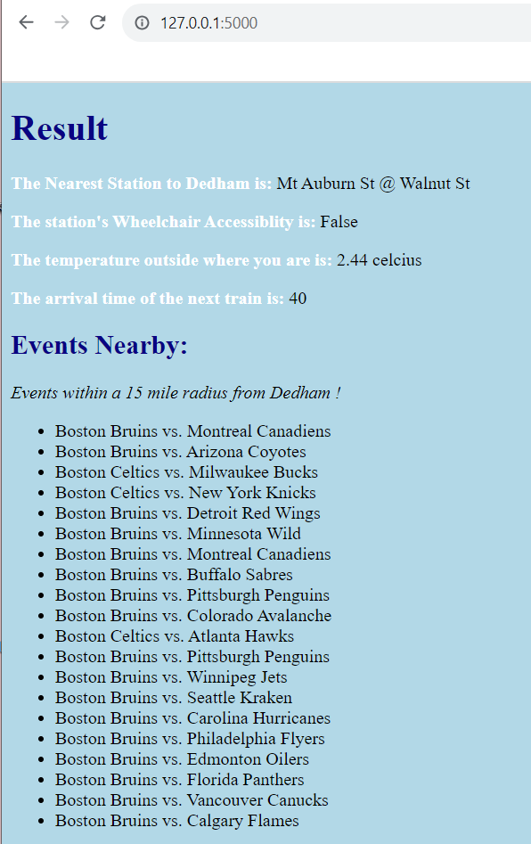

# WebApp-MBTA
 This is the base repository for Web App Developement project. 

## 1. Project Overview
The main concept behind this project is to take a location or address within the greater Boston area and provide information on the nearest MBTA station, including its wheelchair accessibility status. Additionally, the project retrieves the current temperature at the given location, estimates the time until the next train arrival, and compiles a list of events in the nearby area from Ticketmaster within the next two months.
The implementation involves leveraging the MapBox API to obtain location details and coordinates, while the MBTA API supplies information about the closest MBTA stops. The geopy library, specifically the geodesic function, is employed to calculate the distances between stops and to determine their proximity to Boston. Furthermore, the OpenWeather API is utilized to fetch real-time temperature data for the specified location.

## 2. Reflection
1) Process Point of View
What went well in this project was the initial backend development in python. I effectively implemented the initial necessary functionalities. An additional positive aspect of the project was the successful implementation of project testing. I integrated various impressive features into the website by leveraging the existing functions. The Flask-based site was meticulously designed for aesthetic appeal and clarity, contributing to an overall positive testing experience.

An area that still requires enhancement is the computing and loading time of the website. Due to the utilization of four different APIs (MapBox, MBTA, OpenWeather, and TicketMaster), the website experiences prolonged loading times. To address this, I refined the code, eliminating extraneous and unnecessary components, resulting in a slight improvement, however, this could still be enhanced.

Another challenging aspect involved resolving issues related to the functionality for certain town names. Despite the successful implementation for towns like Dedham, Wellesley, Boston, Seaport, Fenway, Harvard, Brookline, Dorchester, Somerville, Allston, and Roxbury, certain town names, such as "Cambridge" or "Dover," did not yield results. I was surprised by this, becuase I used a distance formula for the coordinates and thought this was foolproof. Although, within our class, I realized it was the radius that was the issue. 

Another notable challenge was the train time function. It took me a very long time to figure out why it wasn't working and I struggled to identify the issue. Eventually, upon rereading the MBTA website and printing the response data of the prediction$filter URL, I recognized that it only provided the station ID, not the name. To address this, I had to create a separate function to obtain the ID of the nearest station and utilize it to get the proper functioning of the train time function url. Through this I really learned the importance of printing the respone data at each step of the code it is not working.

The last large challenge I faced was with the ticket master events API. The events were hard to visualize at first, but I realized I had to do a for events in events, in the flask result, to display everything as a list. You can see the inital list for events in the image below.
<!--  -->

Overall what went well was the the project testing, being able to implement a lot of wow factors by utilizing the functions that I already had, and making the site on Flask look aesthteiclaly pleasing and clear. The final output is below
<!--  -->

2) Teamwork
I did this project individually. Initially, I focused on laying the groundwork for the backend and then shifted to Flask development. Then I went back to do the "wow" factors. I enjoyed this structured, as I was able to visualize my data. It also helped me catch NoneTypes and ValueErrors, early on and avoid having to backtrack/

3) Learning Perpective
Through this project, I gained valuable learned a lot about working with various APIs and extracting information, in order to create a large and useful program. Additionally, I acquired proficiency in using Flask. Looking ahead, this endeavor has not only enhanced my problem-solving skills but has also honed my ability to devise creative solutions and ask good questions, as I had worked to combining existing functions to create new ones, broadening the project's capabilities.

In this project, I learned a lot about a new library, called geopy. This library allowed me to calculate the difference between the longitude and latitude of the coordinates of the station and a place we entered in. I was initially struggling at first on how to get the nearest station, however, I decided to ask ChatGpt if there were any libraries to calculate the different between the coordinates between two different places, so I could iterate between the smallest distance of place to coordinates, and then return the station the person should go to. I asked ChatGPT and it said that there was a library called geopy, with something called geodesic in it.  

With my events neabry function, One issue I noticed is that this only generated results for Boston, so using the same geopy I utilized earlier, I wanted to make everything within 15 miles (around a 30 minute drive), included in the Boston-area. This also showed me that one new function I learned could be applicable to many different things, as wells as the ease of looking up different libraries in order ot caluclate things, rather than having to go through the coordinate calculations by myself. 

I thought another very cool feature of this project was learning how to format the URLs in order to pull information from the parameters. After reading What is a URL document and library on python URL library parsing, I feel that I have a better understanding of something so inherent in our everyday lives, URLS!  

This project helped me extremely with problem solving, and while my code. Things I asked ChatGPT for was primarily what different errors meant within the terminal and an analysis of them, as well as asking about the different libraries and capabilities, as well as new libraries like geopy. I think before doing this project, more practice with returns in flask would be much easier, such as figuring out how to deal with the Nones being returned and potential for ValueErrors, and debugging such.  
